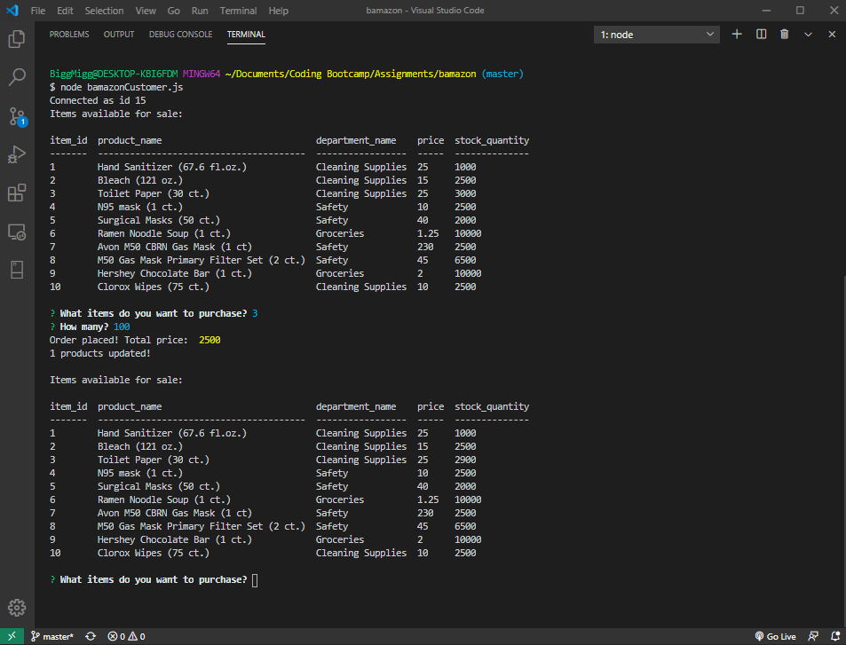

# bamazon

## Overview

Bamazon is an Amazon-like storefront built using Node.js and MySQL. The app will take in orders from customers and deplete stock from the store's inventory. 

`bamazonCustomer.js`: Is a Node app that uses a MySQL Database called `bamazon`. The database contains a `products` table with 10 items for sale.

Running `bamazonCustomer.js` displays all of the items available for sale and then prompts users with two messages.
   * The first prompt asks for the ID of the product they would like to buy.
   * The second prompt asks for a quantity.

Once the customer has placed the order, the app checks if there is sufficient quantities on hand to complete the purchase.
   * If not, the app informs the user that there is `Insufficient quantity!`, and prevents the order from going through.
   * If there is sufficient quantity, the customer's order if fulfilled and the SQL database is updated to reflect the remaining quantity.
   * Once the update goes through, the customer is shown the total cost of their purchase.
  
   
## Tech

**GitHub** - file repository

**Visual Studio Code** - text editor

**Javascript**

**Node.js**

**NPM Packages:**

  * **Inquirer** (https://www.npmjs.com/package/inquirer)
 
   
## Screenshots
     

     

